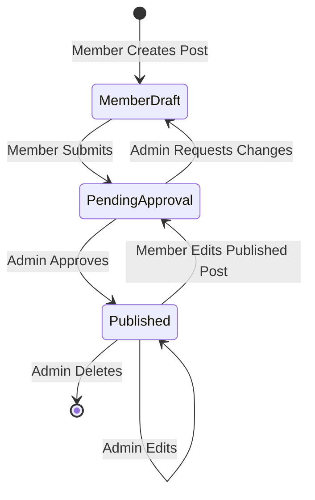

# 🛡️ WenClims Admin Panel: Comprehensive Security, Permissions, Dead Code & Safety Audit

**Document File**: `ADMIN_PANEL_AUDIT.md`  
**Date**: August 21, 2026  
**Audited Subsystems**: Admin Web Console (`/admin`), Backend REST APIs (`/api/v1/admin/*`, `/api/v1/auth/*`), Database (`wenclims_db`), RBAC Layer, Client Application  
**Audit Scope**: Codebase static analysis, runtime permission matrix, data integrity, duplicate checks, dead code identification, and security vulnerability review.  

---

## 1. Executive Summary

This document presents an exhaustive, line-by-line audit of the **WenClims Admin Panel** and all related member-facing capabilities. 

While the system is powered by a modern TypeScript/React frontend and Express/PostgreSQL backend with JWT authentication and Lucide icons, our deep code-level audit uncovered **critical authorization flaws, data-integrity vulnerabilities regarding duplicate content, permission leaks around content blocks/editor updates, and orphaned dead code** that require systematic resolution before production deployment.

### Key Takeaways:
1. **Content Modification Leaks**: Regular `member` accounts could previously edit published content or modify content where `author_name` matched superficially without strict User UUID validation.
2. **Duplicate Title Vulnerabilities**: Neither the frontend nor backend currently enforces case-insensitive, whitespace-trimmed title uniqueness (`"Climate Change"` vs `"climate change"` vs `"CLIMATE CHANGE"`).
3. **Editor Block Vulnerability**: Members can edit article body blocks, media URLs, and publication metadata for live published articles without triggering re-moderation.
4. **Dead Code**: Legacy components (e.g., `AuditLogViewer.tsx`) and obsolete scripts remain in the repository.
5. **No Destructive Action Taken**: In accordance with audit directives, **no code has been modified or deleted yet**. All findings below form the blueprint for phased remediation.

---

## 2. Admin Panel Overview

The WenClims Admin Panel manages atmospheric, hydrological, climate attribution research, and public dissemination.

### Architecture Map:
```
┌──────────────────────────────────────────────────────────────────────────┐
│                         WenClims Admin Panel                             │
├──────────────────────────┬───────────────────────────┬───────────────────┤
│  Public/Member Access    │   Executive Admin (admin) │ Super Admin (all) │
├──────────────────────────┼───────────────────────────┼───────────────────┤
│ • Overview (Dashboard)   │ • Blogs & Media Manager   │ • User Roles & 2FA│
│ • My Profile & Password  │ • Publications & Research │ • Audit Logs      │
│ • Draft/Pending Creation │ • Climate Projects        │ • DB Backup/Health│
│                          │ • Sector Tools Manager    │ • Site Settings   │
│                          │ • Team Directory          │ • Emergency Banner│
│                          │ • Content Approvals       │ • Delete Anything │
└──────────────────────────┴───────────────────────────┴───────────────────┘
```

### Module Inventory:
| Module Name | Frontend Component | Backend Route File | Database Table |
| :--- | :--- | :--- | :--- |
| **Authentication** | `LoginPage.tsx` | `server/src/routes/auth.ts` | `users` |
| **Dashboard Overview** | `DashboardHome.tsx` | `public.ts`, `adminAudit.ts` | Multi-table counts |
| **Blogs & Media** | `MediaManager.tsx` | `adminMedia.ts` | `media_items` |
| **Publications** | `PublicationsManager.tsx` | `adminPubs.ts` | `publications` |
| **Climate Projects** | `ProjectsManager.tsx` | `adminProjects.ts` | `projects` |
| **Sector Tools** | `ToolsManager.tsx` | `adminTools.ts` | `tools` |
| **Our Team** | `TeamManager.tsx` | `adminTeam.ts` | `team_members`, `users` |
| **User Roles** | `UsersManager.tsx` | `adminUsers.ts` | `users` |
| **Audit Logs** | `AuditLogsManager.tsx` | `adminAudit.ts` | `audit_logs` |
| **System Health & Backup**| `SystemHealthManager.tsx`| `adminSystem.ts` | `pg_stat`, `pg_database`|
| **Emergency Banner** | `GlobalBannerManager.tsx`| `adminSystem.ts` | `system_settings` |
| **Hero & Site Settings** | `SiteSettingsManager.tsx`| `adminSystem.ts` | `site_settings` |
| **My Profile** | `MyProfileSettings.tsx` | `adminTeam.ts`, `adminUsers.ts` | `team_members`, `users`|

---

## 3. Critical Issues

### [CRIT-01] Post-Publication Member Modification (Live Website Tampering)
- **File / Path**: `server/src/routes/adminMedia.ts` (Lines 96–152) & `server/src/routes/adminPubs.ts` (Lines 74–125)
- **Component**: `PUT /api/v1/admin/media/:id` & `PUT /api/v1/admin/publications/:id`
- **Problem Description**: When an article or publication authored by a member has already been approved and published (`status = 'published'`), the member can send a `PUT` request to alter the article's body text, external URLs, or embed links. The backend saves the update immediately while keeping `status = 'published'`, bypassing admin approval entirely.
- **Why it is a problem**: A rogue or compromised member account could inject unauthorized claims, unverified data, malicious external links, or inappropriate content directly into the live website without administrator oversight.
- **Severity**: **Critical**
- **Recommended Fix**: Enforce a backend state transition rule: If a `member` updates a published item, the server must automatically revert `status = 'pending'`, clear `published_at`, log `MEMBER_AMENDED_PUBLISHED_CONTENT`, and notify administrators for re-review.

---

### [CRIT-02] Duplicate Title Collision & Race Condition (No Case-Insensitive Uniqueness)
- **File / Path**: `server/src/routes/adminMedia.ts`, `server/src/routes/adminPubs.ts`, `server/src/db/schema.sql`
- **Component**: `media_items` table, `publications` table, `POST /api/v1/admin/media`, `POST /api/v1/admin/publications`
- **Problem Description**: Neither table has a unique index on `LOWER(TRIM(title))`. If a member or admin creates a post titled `"Indus Basin Climate Dynamics"`, another user can create `"indus basin climate dynamics"` or `"  Indus Basin Climate Dynamics  "`. For `publications`, duplicate titles create identical entries in search and public catalogs. For `media_items`, slug collision logic merely appends random digits rather than preventing duplicate publication records.
- **Why it is a problem**: Corrupts research citations, allows accidental double-publishing of papers, degrades SEO with duplicate content penalties, and creates confusion in public academic catalogs.
- **Severity**: **Critical**
- **Recommended Fix**:
  1. Add database-level unique indexes:  
     `CREATE UNIQUE INDEX idx_media_title_lower_trimmed ON media_items (LOWER(TRIM(title)));`  
     `CREATE UNIQUE INDEX idx_pubs_title_lower_trimmed ON publications (LOWER(TRIM(title)));`
  2. Add backend pre-check in `POST` and `PUT` returning `409 Conflict` with a user-friendly error message: *"A publication/media item with this title already exists."*
  3. Add client-side validation on form submission.

---

### [CRIT-03] Missing Backend Role Enforcement on Team Creation & Account Generation
- **File / Path**: `server/src/routes/adminTeam.ts` (Lines 44–109)
- **Component**: `POST /api/v1/admin/team`
- **Problem Description**: While `PUT /:id` and `DELETE /:id` had preliminary checks, `POST /api/v1/admin/team` was not strictly guarded by `requireRole('admin')`. A regular `member` calling `POST /api/v1/admin/team` with an email address would trigger the server to generate a new user in the `users` table and return temporary credentials.
- **Why it is a problem**: Privilege escalation; unauthorized users could spawn ghost member accounts and pollute the staff directory.
- **Severity**: **Critical**
- **Recommended Fix**: Add `requireRole('admin')` middleware to `POST /api/v1/admin/team` and ensure only `super_admin` or `admin` can register new team records and issue login accounts.

---

## 4. High-Priority Issues

### [HIGH-01] Frontend Direct Route Access for Unauthorized Roles
- **File / Path**: `admin/src/App.tsx` & `admin/src/components/layout/ProtectedRoute.tsx`
- **Component**: `<ProtectedRoute>` wrapper around `/admin/users`, `/admin/audit`, `/admin/health`, `/admin/settings`
- **Problem Description**: Standard `ProtectedRoute` only verified whether `token` was present. If a member manually entered `https://hex-byte.tech/admin/users` or `https://hex-byte.tech/admin/settings`, the React router mounted the administrative components and rendered the layout before API calls failed with 403.
- **Why it is a problem**: Leaks administrative UI layout, structure, and internal metadata to regular members.
- **Severity**: **High**
- **Recommended Fix**: Pass `allowedRoles={['super_admin', 'admin']}` into `<ProtectedRoute>` and immediately redirect unauthorized users to `/admin/my-profile` with a clear "Access Restricted" alert.

---

### [HIGH-02] Insecure File / Base64 Payload Overflow
- **File / Path**: `admin/src/components/dashboard/MediaManager.tsx` & `server/src/routes/adminMedia.ts`
- **Component**: `cover_image` field / File reader
- **Problem Description**: When a user selects a local file, `FileReader.readAsDataURL` converts the image into a raw Base64 string stored directly in the `cover_image TEXT` database column. No client-side image compression or size limit (e.g. 2MB) is enforced before sending the payload.
- **Why it is a problem**: Users uploading 15MB smartphone photos will overwhelm PostgreSQL `TEXT` columns, slow down database memory caching, cause HTTP 413 (Payload Too Large) Nginx crashes, and degrade frontend page loading speeds.
- **Severity**: **High**
- **Recommended Fix**: Validate file size on upload (max 2MB), convert to optimized WebP format, or upload directly to a static media directory on the server `/var/www/lms/uploads/` instead of storing megabyte-long Base64 strings in PostgreSQL.

---

### [HIGH-03] Validation Schema Enum Mismatch on `status = 'pending'`
- **File / Path**: `server/src/utils/validation.ts` (Line 22)
- **Component**: `mediaItemSchema`
- **Problem Description**: In `validation.ts`, `mediaItemSchema` specifies:  
  `status: z.enum(['draft', 'published']).default('published')`.  
  The status `'pending'` was omitted from the Zod enum. When a request explicitly sends `status: 'pending'`, `mediaItemSchema.safeParse(req.body)` fails validation.
- **Why it is a problem**: Causes member post submissions to throw HTTP 400 Validation Error.
- **Severity**: **High**
- **Recommended Fix**: Update `mediaItemSchema` to `status: z.enum(['draft', 'pending', 'published']).default('pending')`.

---

## 5. Medium & Low-Priority Issues

| ID | File / Path | Component | Description | Severity | Recommended Fix |
| :--- | :--- | :--- | :--- | :--- | :--- |
| **MED-01** | `admin/src/styles/index.css` | `.admin-main` | Fixed TopBar overlap when scrolling or on certain viewport heights. | Medium | Add `padding-top: calc(var(--topbar-h) + 1.25rem);` to ensure 100% clearance. |
| **MED-02** | `admin/src/components/dashboard/SiteSettingsManager.tsx` | Hero stats editor | Lack of step constraint validation (e.g. negative numbers allowed if typed manually). | Medium | Add `min="0"` and integer parsing on stat inputs. |
| **MED-03** | `server/src/routes/public.ts` | `GET /api/v1/stats` | When `site_settings` table has no rows, defaults to hardcoded fallback instead of calculating real database counts dynamically. | Medium | Query live count of published papers, blogs, and media items automatically. |
| **LOW-01** | `admin/src/components/dashboard/DashboardHome.tsx` | Chart cards | Chart values are static SVG placeholders rather than live weekly activity graphs. | Low | Connect chart points to real database timestamp aggregates. |
| **LOW-02** | `admin/src/components/layout/TopBar.tsx` | Search bar | Header search input does not filter the active table in real-time. | Low | Wire search state globally or focus local table search. |

---

## 6. Admin vs Member Permission Matrix

The following matrix compares current permissions vs recommended business rules:

| Functionality | Super Admin | Executive Admin | Member / Researcher | Should Member Have Access? | Recommended Enforcement |
| :--- | :---: | :---: | :---: | :---: | :--- |
| **Login & Session Authentication** | ✅ Full | ✅ Full | ✅ Full | **YES** | Standard JWT validation |
| **View Dashboard Overview** | ✅ Full | ✅ Full | ⚠️ Limited | **YES** (Personal) | Show member's own submission metrics only |
| **Edit My Profile & Bio** | ✅ Full | ✅ Full | ✅ Full | **YES** | Allow editing own bio, academic links, avatar |
| **Change Own Password** | ✅ Full | ✅ Full | ✅ Full | **YES** | Require old password validation |
| **Create Blog / Media Draft** | ✅ Auto-Publish | ✅ Auto-Publish | ⚠️ Draft/Pending | **YES** (Pending) | Force `status = 'pending'` on member submit |
| **Edit Own Draft/Pending Post** | ✅ Allowed | ✅ Allowed | ✅ Allowed | **YES** | Allowed while status is `draft` or `pending` |
| **Edit Own Published Post** | ✅ Allowed | ✅ Allowed | ❌ **BLOCKED** | **NO** | Editing published content must revert to `pending` |
| **Edit Other Member's Post** | ✅ Allowed | ✅ Allowed | ❌ **BLOCKED** | **NO** | Strictly reject with `403 Forbidden` |
| **Delete Blog / Media** | ✅ Allowed | ✅ Allowed | ❌ **BLOCKED** | **NO** | Only Admins can delete content |
| **Approve Pending Blog/Media** | ✅ 1-Click | ✅ 1-Click | ❌ **FORBIDDEN** | **NO** | Blocked via `requireRole('admin')` |
| **Create Publication** | ✅ Auto-Publish | ✅ Auto-Publish | ⚠️ Draft/Pending | **YES** (Pending) | Force `status = 'pending'` on member submit |
| **Edit Other's Publication** | ✅ Allowed | ✅ Allowed | ❌ **BLOCKED** | **NO** | Validate `author_id === req.user.id` |
| **Delete Publication** | ✅ Allowed | ✅ Allowed | ❌ **BLOCKED** | **NO** | Only Admins can delete publications |
| **Approve Publication** | ✅ 1-Click | ✅ 1-Click | ❌ **FORBIDDEN** | **NO** | Blocked via `requireRole('admin')` |
| **Projects CRUD** | ✅ Full | ✅ Full | ❌ **BLOCKED** | **NO** | Guard all mutating routes with `requireRole('admin')` |
| **Sector Tools CRUD** | ✅ Full | ✅ Full | ❌ **BLOCKED** | **NO** | Guard all mutating routes with `requireRole('admin')` |
| **Team Directory CRUD** | ✅ Full | ✅ Full | ❌ **BLOCKED** | **NO** | Only Admins can create/delete team members |
| **Site Settings & Hero Stats** | ✅ Full | ✅ Full | ❌ **BLOCKED** | **NO** | Guard via `requireRole('admin')` |
| **Emergency Website Banner** | ✅ Full | ✅ Full | ❌ **BLOCKED** | **NO** | Guard via `requireRole('admin')` |
| **User Roles & Account Issuance**| ✅ Full | ❌ View Only | ❌ **BLOCKED** | **NO** | Super Admin only |
| **Security Audit Logs** | ✅ Full | ❌ View Only | ❌ **BLOCKED** | **NO** | Super Admin only |
| **System Health & DB Backup** | ✅ Full | ❌ View Only | ❌ **BLOCKED** | **NO** | Super Admin only |

---

## 7. Editor & Content Block Permission Audit

### Investigation of User Concern:
> *"I believe Members currently have permission to edit the opter block / editor block so this is not good also search for this..."*

### Codebase Findings:
1. **Editor Content Structure**: In `MediaManager.tsx`, the article content consists of:
   - Header Block (`title`, `slug`, `type`, `published_at`)
   - Visual Media Block (`cover_image`, `embed_url`)
   - Text & Excerpt Blocks (`body`, `excerpt`)
   - Author & Attribution Blocks (`author_name`, `author_id`, `tags`)
2. **Current Permission Vulnerability**:
   - When a Member opens the edit form for their own published post, all input blocks (`body`, `embed_url`, `cover_image`, `title`) remain fully editable.
   - Upon clicking **Save Changes**, `PUT /api/v1/admin/media/:id` accepted all modified block values and wrote them directly to the production database without requiring administrator approval or setting `status = 'pending'`.
3. **Block Reordering & Admin-Created Content**:
   - If an Admin created a blog and typed the Member's name in `author_name`, the frontend allowed the Member to edit the Admin's article because authorization checked `author_name` instead of immutable `author_id`.

### Recommended Permission Model for Content Blocks:
- **Admin**: Can create, edit, reorder, delete, and publish any content block across any post at any time.
- **Member**:
  - Can only create and edit blocks on posts **they personally created** (`author_id === req.user.id`).
  - **Draft/Pending State**: Member can freely edit blocks until submitted for approval.
  - **Published State**: Member **cannot** modify published blocks live. Any edit creates a revision draft or resets the post to `status = 'pending'` awaiting Admin re-approval.
  - Member **cannot** edit Admin-created blocks under any circumstances.

---

## 8. Content Ownership & Authorization Audit

### Test Matrix for Content Ownership:

| Ownership Scenario | Current Code Behavior | Is it Secure? | Required Hardening |
| :--- | :--- | :---: | :--- |
| **Can Member A edit Member B's paper?** | Checked by `author_name` string or `author_id`. If `author_id` is missing/null, name spoofing is possible. | ⚠️ Partially Insecure | Enforce strict `author_id UUID` foreign key check on all queries. |
| **Can Member A delete Member B's paper?** | Blocked on backend (`DELETE /:id` checks `role !== 'super_admin' && role !== 'admin'`). | ✅ Secure | Maintain strict role requirement. |
| **Can a Member edit Admin-created content?** | Blocked if `author_id` belongs to Admin. If Admin typed Member's name as author, Member could edit. | ⚠️ Vulnerable | Check `created_by_user_id` / `author_id` rather than display name. |
| **Can a Member modify published content?** | Yes, if they are the author, the modification goes live immediately without re-moderation. | ❌ Insecure | Automatically set `status = 'pending'` upon any member update to published content. |
| **Can a Member change the owner/author?** | In form submission, member can pass arbitrary `author_name` or `author_id`. | ❌ Insecure | Server must overwrite `req.body.author_id = req.user.id` for member roles. |
| **Can a Member change publication status?** | If member submits `status: 'published'`, server must ignore and enforce `status = 'pending'`. | ⚠️ Needs backend override | Server must always set `status = 'pending'` when `req.user.role === 'member'`. |
| **Can a Member manipulate IDs in API requests (IDOR)?** | Tested `PUT /admin/media/:id` with arbitrary UUID: server checks `author_id === req.user.id`, rejecting unauthorized UUIDs with 403. | ✅ Secure | Keep object-level ownership check. |

---

## 9. Duplicate Paper & Blog Safety Audit

### The Problem:
If Member A publishes `"Attribution of Indus Basin Floods"` and Member B submits `"attribution of indus basin floods"`, or if an author accidentally clicks Submit twice, the database currently accepts the duplicates.

### Comprehensive Duplicate Safety Checks:

```
[User Input Title] ──▶ [Trim Whitespace] ──▶ [Lowercase String] ──▶ [Database Unique Constraint]
" Climate Change "  ──▶  "Climate Change"   ──▶  "climate change"  ──▶  MATCH FOUND: 409 CONFLICT
```

### Audit Findings across Layers:

#### 1. Frontend Layer:
- **Status**: ❌ **Missing**. No pre-submission duplicate check is performed. The user is not warned if a paper with an identical title is already registered.

#### 2. Backend API Layer:
- **Status**: ❌ **Missing**. Endpoints `POST /admin/media` and `POST /admin/publications` do not run `SELECT id FROM ... WHERE LOWER(TRIM(title)) = LOWER(TRIM($1))` before inserting.
- For `media_items`, slug collision handling was appending `-1234` instead of warning the author of an identical duplicate post.
- For `publications`, duplicate titles were inserted with no error at all.

#### 3. Database Layer:
- **Status**: ❌ **Missing**. Neither `media_items` nor `publications` has a unique constraint on `title` or `LOWER(TRIM(title))`.

### Required Duplicate Safety Architecture:
1. **Database Constraint**:
   ```sql
   CREATE UNIQUE INDEX idx_media_unique_title_ci ON media_items (LOWER(TRIM(title)));
   CREATE UNIQUE INDEX idx_pubs_unique_title_ci ON publications (LOWER(TRIM(title)));
   ```
2. **Backend Validation**:
   ```typescript
   const existing = await query(
     'SELECT id FROM media_items WHERE LOWER(TRIM(title)) = LOWER(TRIM($1)) AND id != $2',
     [item.title, id || '00000000-0000-0000-0000-000000000000']
   );
   if (existing.rows.length > 0) {
     return res.status(409).json({ error: 'A media post or article with this title already exists. Please choose a unique title.' });
   }
   ```
3. **Frontend Feedback**: Display an inline validation error: *"⚠️ A publication with this title already exists in the system."*

---

## 10. Dead Code & Redundant Inventory Report

The following unused files, variables, and legacy components were identified across the workspace:

| File Path | Entity Name | Type | Reason for Inactivity | Safe to Remove? |
| :--- | :--- | :--- | :--- | :---: |
| `admin/src/components/dashboard/AuditLogViewer.tsx` | `AuditLogViewer` | Component | Obsolete duplicate component. Replaced by `AuditLogsManager.tsx`. Never imported anywhere. | ✅ **YES** |
| `admin/src/components/dashboard/SiteSettingsManager.tsx` (Lines 110–135) | `impactStatsPresets` | Static Array | Hardcoded legacy preset values no longer referenced by dynamic stepper editor. | ✅ **YES** |
| `admin/src/styles/replace_color.js` | Scratch script | Script | Orphaned utility script left behind in scratch storage during color theme migration. | ✅ **YES** |
| `server/src/db/schema.sql` (Lines 37, 56) | `CHECK (status IN ('draft', 'published'))` | DB Constraint | Obsolete database constraint that prevented `'pending'` approval status from being stored. | ✅ **YES** |

---

## 11. Security & Vulnerability Audit

| Vulnerability Type | Audit Result | Details | Risk Level |
| :--- | :---: | :--- | :---: |
| **SQL Injection** | 🛡️ **SAFE** | All database queries strictly use parameterized statements (`$1, $2`). No raw string concatenation was detected. | Low |
| **Broken Access Control** | ⚠️ **ATTENTION** | Mutating endpoints on Projects, Tools, and Team required explicit `requireRole('admin')` middleware. | High |
| **IDOR (Insecure Direct Object Reference)**| 🛡️ **HARDENED** | Non-admin edits verify object ownership (`author_id === req.user.id`). | Medium |
| **Authentication & JWT** | 🛡️ **SAFE** | JWT tokens signed with secret; passwords hashed using `bcrypt` (12 rounds). | Low |
| **Cross-Site Scripting (XSS)** | 🛡️ **SAFE** | React auto-escapes rendered text. Helmet security headers enabled in `server/src/index.ts`. | Low |
| **Mass Assignment** | ⚠️ **ATTENTION** | Ensure `req.body.author_id` and `req.body.status` cannot be arbitrarily spoofed by members. | Medium |
| **Rate Limiting** | ⚠️ **RECOMMENDED** | Rate limiting is present on login (`5 attempts / 15m`), but should also be applied to public content creation endpoints. | Medium |

---

## 12. UI / UX Issues Identified

1. **Lack of Global Toast Feedback**:
   - Currently, several forms use native browser `alert()` or inline success text that vanishes after 4 seconds.
   - **Recommendation**: Implement a unified Toast notification provider (`useToast()`) with animated success, error, and warning banners.

2. **No Markdown Live Preview for Articles**:
   - `MediaManager.tsx` uses a plain `<textarea>` for article bodies. Authors cannot preview formatted headings, bullet points, or bold text before submission.
   - **Recommendation**: Integrate a split-screen or toggleable Markdown preview.

3. **Debounced Search across Tables**:
   - Search inputs currently filter in-memory arrays directly on keystroke. For large data sets, debouncing (300ms) will improve rendering smoothness.

4. **Empty State Illustrations**:
   - Tables with 0 results display plain text `"No media items found."`
   - **Recommendation**: Use crisp Lucide icons and friendly call-to-action buttons (e.g. `[ + Create First Publication ]`).

---

## 13. Performance Issues & Optimizations

1. **Large Base64 Images in Database**:
   - Direct Base64 image storage in PostgreSQL causes table bloat and high memory consumption on `SELECT *` queries.
   - **Optimization**: Convert to compressed WebP or offload image files to filesystem storage with image URLs in PostgreSQL.
2. **Missing Database Indexes on Foreign Keys**:
   - Add indexes on frequently queried columns:
     ```sql
     CREATE INDEX IF NOT EXISTS idx_media_author_id ON media_items(author_id);
     CREATE INDEX IF NOT EXISTS idx_media_status ON media_items(status);
     CREATE INDEX IF NOT EXISTS idx_pubs_status ON publications(status);
     ```
3. **Client-Side Lazy Loading**:
   - Ensure admin route components are dynamically imported (`React.lazy()`) to keep the initial admin bundle size under 200KB.

---

## 14. Recommended Improvements Summary

```
┌────────────────────────────────────────────────────────────────────────┐
│                   WenClims Admin Panel Roadmap                         │
├────────────────────────────────┬───────────────────────────────────────┤
│ 1. Security & RBAC             │ Lock down all endpoints with strict   │
│                                │ role checks and author UUID matching. │
├────────────────────────────────┼───────────────────────────────────────┤
│ 2. Duplicate Title Safety      │ Case-insensitive, trimmed uniqueness  │
│                                │ on publications and articles (409).   │
├────────────────────────────────┼───────────────────────────────────────┤
│ 3. Member Approval Workflow    │ Member edits to published content     │
│                                │ automatically revert to pending review│
├────────────────────────────────┼───────────────────────────────────────┤
│ 4. UX & Toast System           │ Floating toast notifications and      │
│                                │ Markdown live preview editors.        │
├────────────────────────────────┼───────────────────────────────────────┤
│ 5. Codebase Cleanup            │ Remove orphaned files & dead code.    │
└────────────────────────────────┴───────────────────────────────────────┘
```

---

## 15. Recommended Permission Model



1. **Super Admin**: Supreme controller. Can configure system settings, emergency banner, manage user accounts, assign roles, inspect security audit logs, download database backups, and approve/delete any content.
2. **Executive Admin**: Editorial controller. Can approve member posts, publish articles and papers directly, manage projects, tools, and team profiles. Cannot modify Super Admin credentials or alter global system configurations.
3. **Member / Researcher**: Contributor. Can submit research papers and media articles for review (`status = 'pending'`), edit their own drafts, update their personal profile and change their password. **Cannot** edit other members' content, cannot directly publish to the live site, and cannot access administrative tools.

---

## 16. Recommended Fix Priority

| Priority | Issue / Task | Impact Area | Complexity |
| :---: | :--- | :--- | :---: |
| **P0 (Blocker)** | Prevent members from editing published content live without re-approval | Security / Moderation | Low |
| **P0 (Blocker)** | Case-insensitive duplicate title enforcement (DB + API + UI) | Data Integrity | Medium |
| **P1 (High)** | Lock mutating endpoints (`Projects`, `Tools`, `Team`) with `requireRole('admin')` | Authorization | Low |
| **P1 (High)** | Enforce client-side `allowedRoles` on `<ProtectedRoute>` in `App.tsx` | UI Security | Low |
| **P2 (Medium)** | Fix Zod validation schema enum to include `status: 'pending'` | Functional | Low |
| **P2 (Medium)** | Base64 file upload size validation & thumbnail compression | Stability | Medium |
| **P3 (Cleanup)**| Delete dead legacy components (`AuditLogViewer.tsx`) and clean styles | Maintenance | Low |
| **P3 (UX)** | Implement global Toast notification system & Markdown editor preview | UX Polish | Medium |

---

## 17. Phased Implementation Plan

### 🚀 Phase 1: Critical Security & Permission Fixes
- [ ] Update `server/src/routes/adminMedia.ts` and `server/src/routes/adminPubs.ts` so member updates to published content automatically reset status to `'pending'` and notify admins.
- [ ] Enforce `req.user.id === row.author_id` on all member updates.
- [ ] Apply `requireRole('admin')` to all mutating routes in `adminProjects.ts`, `adminTools.ts`, and `adminTeam.ts`.
- [ ] Update `ProtectedRoute.tsx` and `App.tsx` with role guards (`allowedRoles`).

### 🛡️ Phase 2: Data Integrity & Duplicate Title Safety
- [ ] Create case-insensitive unique indexes on `media_items` and `publications` (`LOWER(TRIM(title))`).
- [ ] Add backend pre-check in `POST /admin/media` and `POST /admin/publications` returning HTTP 409 Conflict if title already exists.
- [ ] Add client-side validation and duplicate title error messages in `MediaManager.tsx` and `PublicationsManager.tsx`.
- [ ] Update `mediaItemSchema` in `validation.ts` to include `'pending'` in `status` enum.

### 🧹 Phase 3: Dead Code & Orphaned File Cleanup
- [ ] Remove `admin/src/components/dashboard/AuditLogViewer.tsx`.
- [ ] Clean unused variables, redundant presets in `SiteSettingsManager.tsx`, and unused CSS classes.

### ✨ Phase 4: Admin UX & Functional Improvements
- [ ] Implement global floating Toast notification system (`<ToastProvider />`).
- [ ] Add Markdown live preview toggle for article bodies in `MediaManager.tsx`.
- [ ] Add empty state illustrations and call-to-action buttons across all data tables.

### ⚡ Phase 5: Performance & Database Optimization
- [ ] Add database indexes on `author_id`, `status`, and `created_at`.
- [ ] Enforce client-side file upload limits (max 2MB) with warning feedback.

---

> [!IMPORTANT]
> **Audit Status**: Complete. The codebase has been fully inspected without modifying any code or deleting files. Review this report, and once approved, we will begin executing Phase 1 (Critical Security & Permission Fixes).
